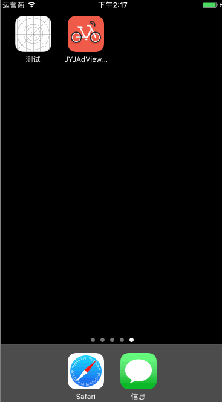

# JYJAdViewController
启动页广告

# GIF


# Message
 `JYJAdViewController ` 模仿摩拜启动页广告，支持gif
# Usage
 `JYJAdViewController ` 很简单，利用SDWebImage存储显示图片，方便快捷：

1、关键代码

```
// 开始下载图片
[[SDWebImageDownloader sharedDownloader] downloadImageWithURL:url options:SDWebImageDownloaderUseNSURLCache progress:nil completed:^(UIImage * _Nullable image, NSData * _Nullable data, NSError * _Nullable error, BOOL finished) {
 	// 开始存储图片
	[[SDImageCache sharedImageCache] storeImage:image imageData:data forKey:urlString toDisk:YES completion:nil];
	NSDictionary *dict = [NSDictionary dictionaryWithContentsOfFile:[[NSBundle mainBundle] pathForResource:@"promotion.plist" ofType:nil]];
	// 数据写入文件
	NSData *contentData = [NSJSONSerialization dataWithJSONObject:dict options:kNilOptions error:nil];
	[contentData writeToFile:self.lastPromotionPageFile atomically:YES];
}];

```

# 联系我
 QQ 453255376, 如有bug、不明白的，希望大家踊跃联系我，把程序写的更好。
 
